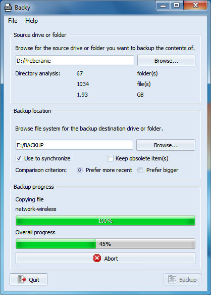

# Backy : simple backup solution

Backy is a simple and open-source solution for creating and maintaining backups of a folder or an entire drive.

## Build

This project uses the qmake build system. Just run qmake in the build folder which will generate the most recent makefile you can use to build Backy.

## Usage

Backy's graphical user interface is very intuitive notable for beginner users.

Detailed documentation will be available soon :-)

## Author

Backy was created and is maintained by [Marek Felsoci](mailto:marek.felsoci@etu.unistra.fr), Master IT student at [University of Strasbourg](http://unistra.fr) in France.

## License

Backy is licensed under the terms of **GNU General Public License version 3.0**.
