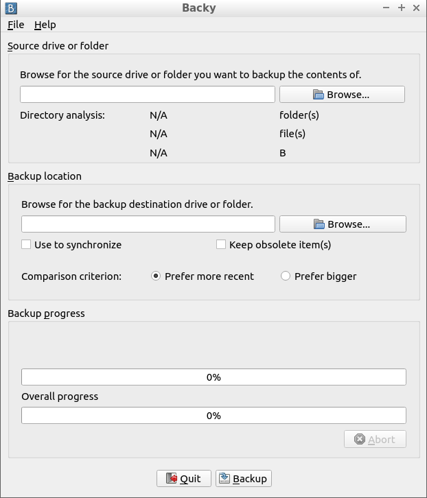

# Backy : simple backup solution

Backy is a simple and open-source solution for creating and maintaining backups of a folder or an entire drive.

## Build

This project uses the CMake build system. Firstable you need to run CMake in the build folder which will generate the most recent makefile you can use to build Backy.

## Usage

Backy can be launched both from command line as well as the graphical user interface.

### CLI

The right syntax to run Backy correctly from your command line interface is as follows:

`backy <source> <destination> [−s <choice> −c <criterion> −k −m <MBytes> −l <code> −q]`

**Options description:**

- **-s** \<choice\> : if the destination folder or drive is not empty this option will tell the program whether it
should keep existing files and use them in backup process to synchronize with source (*choice* value **keep**) or overwrite all of them and perform a fresh backup (*choice* value **overwrite**)
- **-c** \<criterion\> : decides whether the files between source and an existing previous backup are compared by date of last modification (*criterion* value **date**) or by size (*criterion* value **size**)
- **-k** : if an existing previous backup contains files which are no longer present in the source location this option forces the program to keep these files in the backup (the files are deleted if this option is not set)
- **-b** <no. of items> : defines the size of item buffer used by the program to read source location entries
- **-B** \<MBytes\> : defines the size of copy buffer used by the program to copy files from source location to destination
- **-l** \<code\> : chooses the language of the program for the current execution
- **-q** : quiet mode (no output except errors)

### GUI

Backy's graphical user interface is much more intuitive notable for beginner users as you can observe on the screenshot below:

Forther documentation on how to use Backy via its GUI can be found in program's documentation online.

## Localization

Backy is currently localized in English, French and Slovak. There will be likely more translations availale in the future. If you wish to contribute to localize Backy you can contact the author for more information on how to do it.

## Author

Backy was created and is maintained by [Marek Felsoci](marekonline.eu), Master IT student at [University of Strasbourg](unistra.fr) in France.

## License

Backy is licensed under the terms of **GNU General Public License version 3.0**. For more details on license terms see the [LICENSE](LICENSE) file.
